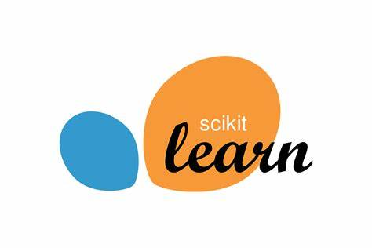
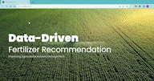

<div align="center">

# Data-Driven Fertilizer Prediction

</div>

## About

<b>Data-driven fertilizer recommendation is an advanced agricultural practice that utilizes data and technology to optimize fertilizer application in crop production. It involves the collection, analysis, and interpretation of various data types, such as soil nutrient levels, weather conditions, crop growth stage, and yield goals, to provide customized fertilizer recommendations for farmers. These recommendations aim to achieve maximum crop yields while minimizing environmental impact, reducing costs, and improving sustainability in agriculture.</b> 

- 


React JS was used to build the frontend part of the application.<br/>


## Steps to run the React Application in local

1. Clone this repo.
2. Open command prompt in the following folder "pickhacks2023"
3. Install all the npm packages

```
npm install
```

4. Start the application

```
npm start
```

The Application Runs on localhost:3000


4. Run the server2.py file

```
python3 server2.py
```

## Tech Stack Used

<div align="center">

<table>
    <tr>
        <td></td>
        <td></td>
    </tr>
    <tr>
        <td></td>
        <td></td>
    </tr>
</table>


## Demo Of Web Application



<div align="center">

Please do ⭐ this repo if you liked my work.

</div>
